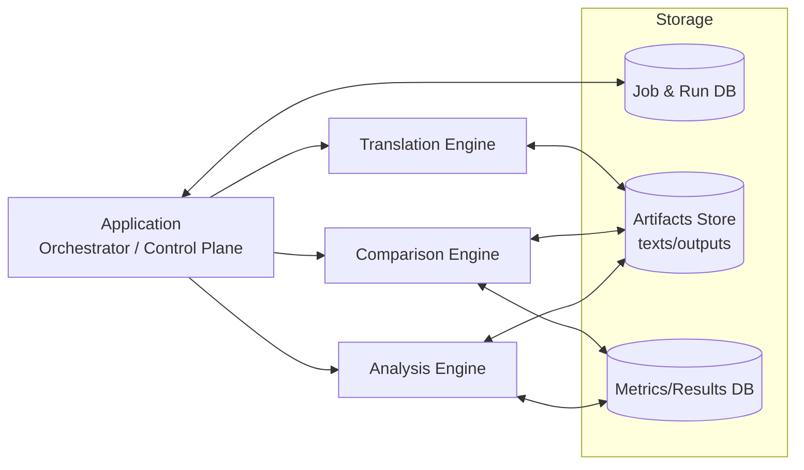
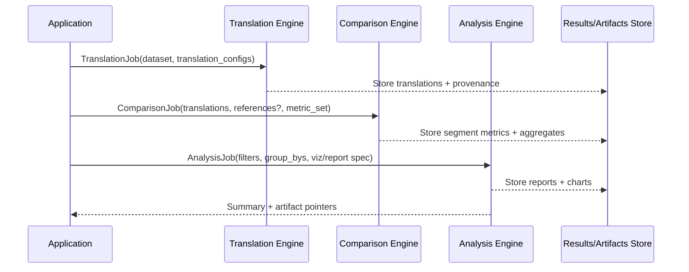
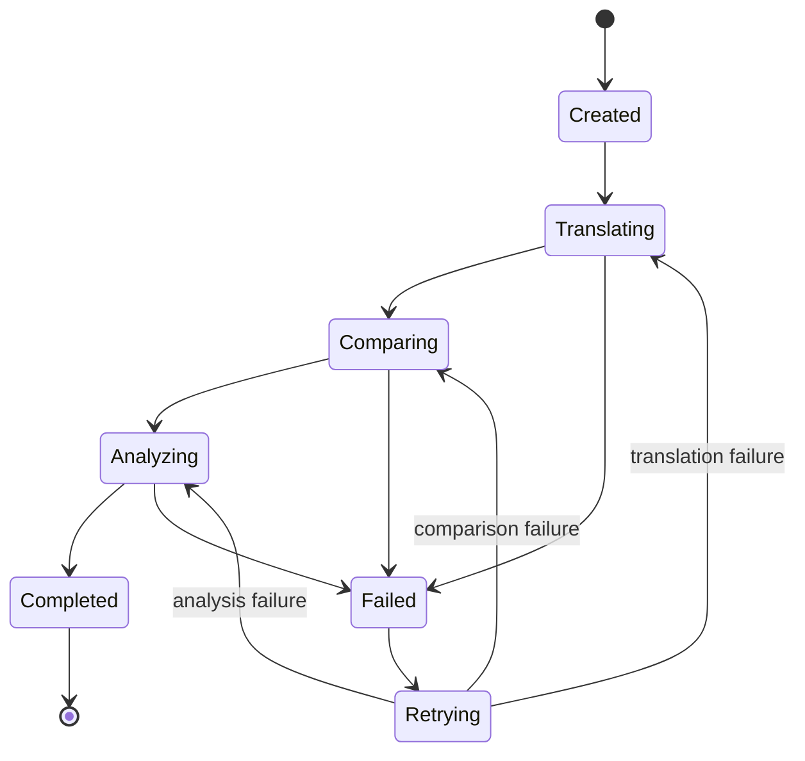

# Translation Evaluation & Analytics Suite — Project Outline

This project evaluates and compares translations across different translation types, providers, and models, then produces analytics and visualizations to support broad, repeatable decision-making.

## Goals

- Provide a repeatable experiment harness for translation evaluation.
- Support multiple translation backends (hosted APIs and/or local models).
- Compare outputs with multiple metrics (reference-based and reference-free).
- Aggregate results into actionable analytics and visualizations.
- Capture provenance (config, versions, latency, cost) for reproducibility.

## Non-goals (initially)

- Real-time interactive translation UI (focus is evaluation, not end-user translation).
- Full distributed compute (start single-machine; design contracts so it can scale later).
- Human annotation tooling (provide export hooks; integrate later if needed).

---

## 1) System Architecture (4 Main Components + Shared Storage)

### Component responsibilities (high level)

- **Application (Orchestrator / Control Plane)**
  - Owns the run lifecycle and the “source of truth” for what happened.
  - Schedules work, manages concurrency, retries, backpressure, and rate limiting.
  - Tracks configurations, dataset versions, and artifacts.
  - Exposes CLI/API to start and inspect runs.

- **Translation Engine**
  - Produces candidate translations from source text using chosen provider/model/config.
  - Normalizes outputs and metadata (model id, decoding params, token usage, latency).
  - Supports batching, caching, and segmentation strategies.

- **Comparison Engine**
  - Computes evaluation metrics for translations:
    - against references (when available) and/or
    - pairwise comparisons between translation variants.
  - Produces segment-level metrics and run-level aggregates.
  - Emits error tags/buckets to support analysis (e.g., terminology breaks, omissions).

- **Analysis Engine**
  - Aggregates and slices comparison results by dimensions:
    - language pair, domain, dataset, model/provider, decoding variant, etc.
  - Produces statistical summaries and visualizations.
  - Generates reports and exports (CSV/JSON/Parquet + HTML/Markdown).

### Shared storage (conceptual)

- **Job & Run DB**: run states, configs, scheduling metadata, idempotency keys.
- **Artifacts Store**: source segments, translations, prompts, traces, reports, charts.
- **Metrics/Results DB**: segment metrics, aggregates, derived analytics tables.

### Mermaid: component diagram

---

## 2) End-to-End Workflow

### Stages

1. **Ingest**
   - Load dataset (source segments, optional references, metadata).
   - Validate schema and normalize segmentation.

2. **Translate**
   - Execute one or more translation configurations (provider/model/params).
   - Store translations + provenance per segment and per batch.

3. **Compare**
   - Compute configured metrics.
   - Store segment-level metrics, run-level aggregates, and comparison summaries.

4. **Analyze**
   - Aggregate and compute cross-run comparisons.
   - Generate charts and report artifacts.

5. **Export**
   - Produce structured exports for external tools and dashboards.

### Mermaid: sequence diagram

---

## 3) Application (Orchestrator / Control Plane)

### Primary responsibilities

- Run management:
  - Create runs, track stage state, record config hashes, ensure idempotency.
- Scheduling:
  - Dispatch work to worker pools per component and per provider.
  - Rate limiting for external APIs (per provider/model).
- Concurrency:
  - Multi-threading/async execution, bounded queues, backpressure.
- Reliability:
  - Retries with exponential backoff, circuit breakers, partial reruns.
- Reproducibility:
  - Persist config snapshots, dataset version info, dependency versions.
- Interfaces:
  - CLI first; optionally add a local API service later.

### Suggested run state machine

### Core modules (recommended)

- `JobManager`: state machine + persistence + run lifecycle
- `Scheduler`: dispatching + fairness + rate limits
- `WorkerPool`: bounded queues, concurrency primitives, cancellation
- `ArtifactRegistry`: stable artifact naming, hashing, and lookup
- `ConfigManager`: typed configs, validation, immutable snapshots per run
- `ExperimentTracker`: provenance capture, summary metrics, run indexing

---

## 4) Translation Engine

### Responsibilities

- Normalize translation requests and outputs across providers/models.
- Support batching and segmentation.
- Produce metadata needed for analysis:
  - model identifier, version, decoding params, prompt/template hash (if used),
  - latency, token usage, and estimated cost.

### Inputs (conceptual)

- dataset segments:
  - `segment_id`, `source_text`, `source_lang`, `target_lang`, `metadata`
- translation configuration:
  - provider, model, temperature/top_p, glossary/constraints, prompts/templates

### Outputs (conceptual)

- `translation_text` per segment
- optional:
  - alignments (token/phrase), alternative candidates (n-best), logs/traces
- `provenance`:
  - provider/model, params, request hash, timestamps, latency, usage/cost

### Implementation approach

- Provider adapters, e.g.:
  - `OpenAIAdapter`, `DeepLAdapter`, `GoogleAdapter`, `LocalModelAdapter`
- Caching:
  - deterministic cache key = hash(source_text + config + segmentation)
- Batching:
  - maximize throughput without violating provider limits

---

## 5) Comparison Engine

### Responsibilities

- Compute evaluation metrics and store them consistently across runs.
- Support both:
  - **Reference-based** evaluation (if dataset includes references), and
  - **Reference-free / pairwise** evaluation (when references are absent).

### Comparison modes

- Translation vs reference (segment-level and run-level)
- Pairwise model comparisons (A vs B), including win-rate and deltas
- Round-trip checks (source→target→source) for sanity signals (optional)
- Export for human review (optional future extension)

### Metrics (examples; extendable)

- Surface/lexical:
  - chrF, BLEU, length ratio, punctuation preservation
- Semantic:
  - embedding cosine similarity; model-based metrics (if integrated)
- Quality heuristics:
  - terminology/glossary adherence, named entity consistency,
  - omission/addition detection heuristics

### Outputs

- Segment metrics:
  - `segment_id`, `translation_id`, `metric_name -> value`, optional tags
- Aggregates:
  - mean/median, percentiles, bootstrap confidence intervals (optional),
  - error bucket counts, failure rates (e.g., empty outputs)

---

## 6) Analysis Engine

### Responsibilities

- Aggregate and summarize results to answer questions like:
  - “Which model is best for language pair X in domain Y?”
  - “What is the quality vs latency/cost tradeoff?”
  - “Where do models fail (terminology, entities, omissions)?”
- Produce visualizations and reports suitable for sharing and iteration.

### Typical analytics dimensions (group-bys)

- language pair, domain, dataset version
- provider/model, decoding configuration, prompt/template variant
- segment length buckets, topic/category, formality/style labels (if present)

### Visualization outputs (examples)

- leaderboards and metric tables
- box plots / violin plots of score distributions
- scatter: quality vs latency vs cost (Pareto-style views)
- heatmaps by language pair
- drill-down: worst segments and error tag summaries

### Report formats

- machine-readable exports:
  - JSON/CSV/Parquet
- human-readable:
  - Markdown/HTML reports, optionally PDF later

---

## 7) Contracts & Data Model (Conceptual)

Define stable schemas early so components can evolve independently.

### Core entities

- `Dataset`
  - `dataset_id`, `version`, `segments[]`, optional `references[]`
- `Run`
  - `run_id`, `created_at`, `config_snapshot`, `status`, `artifacts[]`
- `Translation`
  - `translation_id`, `run_id`, `segment_id`, `config_id`, `text`, `provenance`
- `MetricResult`
  - `metric_result_id`, `translation_id`, `segment_id`, `metric_name`, `value`, `tags[]`
- `ReportArtifact`
  - `artifact_id`, `run_id`, `type`, `path`, `summary`

### General design principles

- Make runs immutable: new config ⇒ new run.
- Store raw artifacts and derived results separately (traceability).
- Prefer append-only writes for auditability; avoid in-place mutation.

---

## 8) Suggested Repository Layout (Conceptual)

- `app/` — orchestration, CLI/API, scheduling, persistence
- `translation_engine/` — adapters, caching, batching, normalization
- `comparison_engine/` — metric registry, evaluators, scoring pipelines
- `analysis_engine/` — aggregators, viz, reporting
- `schemas/` — shared contracts/models
- `storage/` — artifact I/O, database connectors/migrations
- `tests/` — fixtures, golden tests, metric sanity tests

---

## 9) MVP Plan (Smallest Useful Slice)

1. **Application**
   - CLI to run: `translate → compare → analyze`
   - Single-machine concurrency (simple worker pools)
   - Simple persistence (e.g., SQLite + artifact directory)

2. **Translation Engine**
   - One provider adapter + one trivial baseline (to validate plumbing)
   - Provenance capture + caching

3. **Comparison Engine**
   - 2–3 metrics (e.g., chrF, length ratio, embedding cosine)
   - Segment-level metrics + run-level aggregates

4. **Analysis Engine**
   - Leaderboard table output + one visualization
   - CSV export and a basic Markdown/HTML report

---

## 10) Open Questions (to finalize design)

- Execution model:
  - Single machine only, or plan for distributed workers soon?
- Evaluation mode:
  - Always reference translations available, or must be reference-free by default?
- Interfaces:
  - CLI only, or add an API service + web dashboard?
- Storage:
  - Local files + SQLite first, or Postgres + object storage?
- Model metrics:
  - Are you planning to include model-based evaluators (COMET/BLEURT-style), which require additional runtime and model management?
