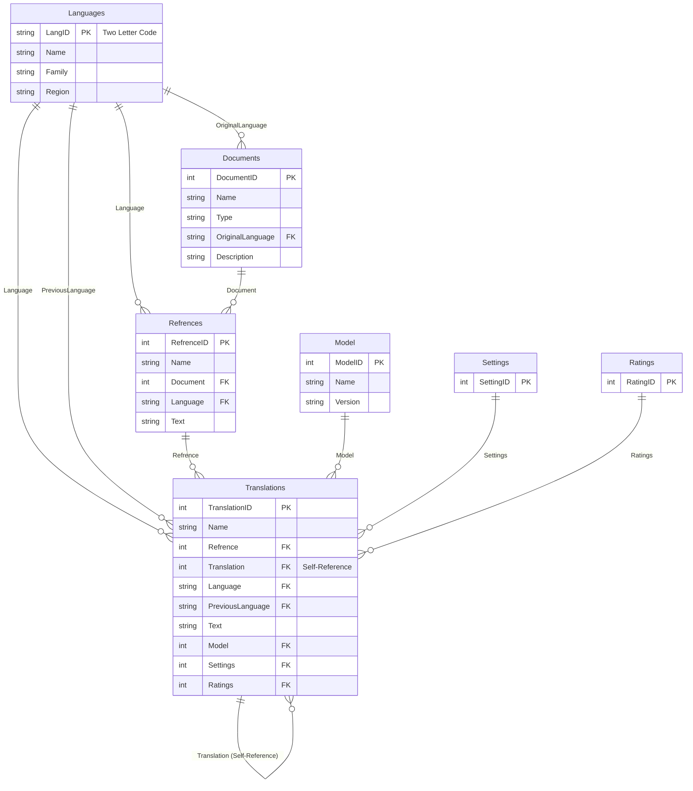

# Database Schema Map

```mermaid
erDiagram
    Languages ||--o{ Documents : "OriginalLanguage"
    Languages ||--o{ Refrences : "Language"
    Languages ||--o{ Translations : "Language"
    Languages ||--o{ Translations : "PreviousLanguage"
    
    Documents ||--o{ Refrences : "Document"
    
    Refrences ||--o{ Translations : "Refrence"
    
    Translations ||--o{ Translations : "Translation (Self-Reference)"
    
    Model ||--o{ Translations : "Model"
    Settings ||--o{ Translations : "Settings"
    Ratings ||--o{ Translations : "Ratings"

    Languages {
        string LangID PK "Two Letter Code"
        string Name
        string Family
        string Region
    }

    Model {
        int ModelID PK
        string Name
        string Version
    }

    Settings {
        int SettingID PK
    }

    Ratings {
        int RatingID PK
    }

    Documents {
        int DocumentID PK
        string Name
        string Type
        string OriginalLanguage FK
        string Description
    }

    Refrences {
        int RefrenceID PK
        string Name
        int Document FK
        string Language FK
        string Text
    }

    Translations {
        int TranslationID PK
        string Name
        int Refrence FK
        int Translation FK "Self-Reference"
        string Language FK
        string PreviousLanguage FK
        string Text
        int Model FK
        int Settings FK
        int Ratings FK
    }
```
